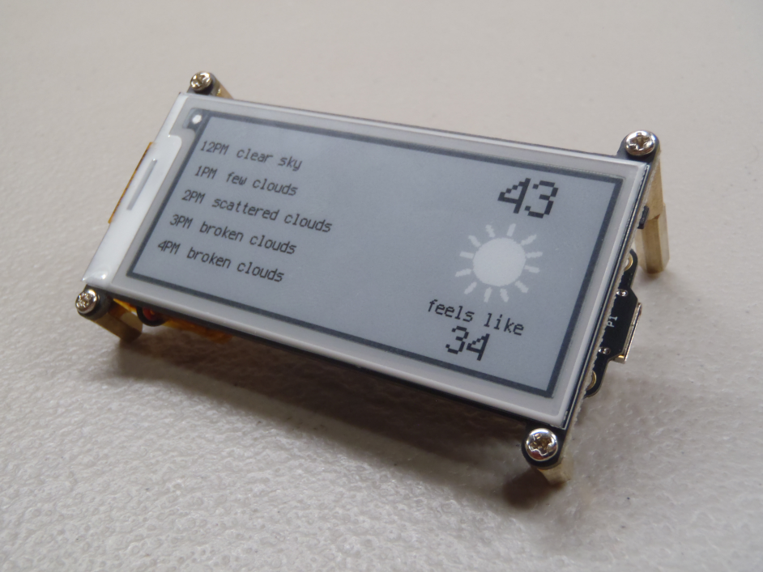
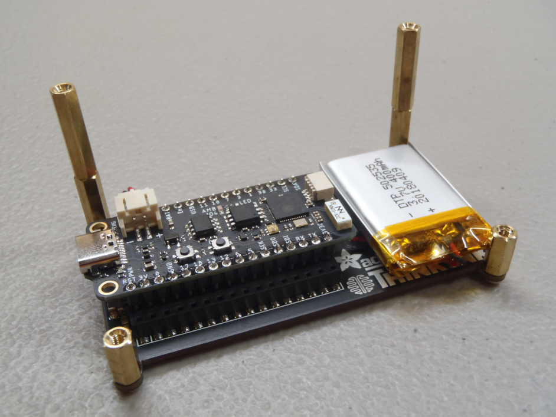

# Weather Forecast Display

My wife and I like to go on walks during the lunch hour. She always asks me two questions: "What does the temperature feel like?" and "Will it rain on us?" I decided to put together a little display for our kitchen counter that can answer both questions.

* [Unexpected Maker FeatherS2](https://feathers2.io/) available at [Adafruit](https://www.adafruit.com/product/4769)
* [Adafruit 2.9" Greyscale eInk FeatherWing](https://www.adafruit.com/product/4777)
* [Lithium Ion Battery - 400mAh](https://www.sparkfun.com/products/13851)
* [CircuitPython 6.2.x](https://circuitpython.org/board/unexpectedmaker_feathers2/) using openweathermap.py and weather_display.py (copied to code.py)

